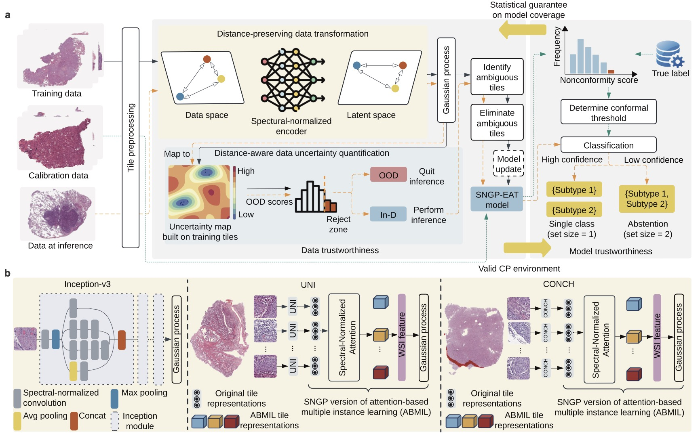

# TRUECAM 


## Implementing Trust in Non-Small Cell Lung Cancer Diagnosis with a Conformalized Uncertainty-Aware AI Framework in Whole-Slide Images

[Preprint]() | [Cite](#reference)

**Abstract:** Ensuring trustworthiness is fundamental to the development of artificial intelligence (AI) that is considered societally responsible, particularly in cancer diagnostics, where a misdiagnosis can have dire consequences. However, current AI models for digital pathology are limited in their ability on hone to the sections of slide where there is greater chance of making a correct diagnosis. To address this issue, we developed TRUECAM, a framework designed to ensure both data and model trustworthiness in non-small cell lung cancer subtyping with whole-slide images. TRUECAM integrates 1) a spectral-normalized neural Gaussian process for identifying out-of-scope inputs and 2) an ambiguity-guided elimination of tiles to filter out highly ambiguous regions, addressing data trustworthiness, as well as 3) a conformal prediction model to ensure controlled error rates. We systematically evaluated the framework across multiple large-scale cancer datasets, leveraging both task-specific and foundation models, illustrate that an AI model wrapped with TRUECAM significantly outperforms models that lack such guidance, in terms of classification accuracy, robustness, interpretability, and data efficiency, while also achieving improvements in fairness.

<p align="center">
    

</p>


## What is TRUECAM?
TRUECAM (**TR**ustworthiness-focused, **U**ncertainty-aware, **E**nd-to-end **CA**ncer diagnosis with **M**odel-agnostic capabilities.) is a framework that designed to simultanuously ensure data and model trustworthiness: 1) a spectral-normalized neural Gaussian process (SNGP) to establish informative data representation and uncertainty quantification, 2) an elimination of ambiguous tiles (EAT) mechanism for filtering out noisy patches from slides, and 3) conformal prediction (CP) to enable a statistically guaranteed error rate
- _**Why use TRUECAM?**_: TRUECAM can be seamlessly deployed in conjunction with SOTA foundation models ([UNI](https://github.com/mahmoodlab/UNI), [CONCH](https://github.com/mahmoodlab/CONCH), [Prov-Gigapath](https://github.com/prov-gigapath/prov-gigapath), [TITAN](https://github.com/mahmoodlab/TITAN)) that utilize pretrained visual encoders. Its flexible framework allows for the incorporation of various deep learning models to **enhance performance** on medical imaging tasks, ensuring that TRUECAM benefits from recent advancements in AI while providing robust **uncertainty quantification and interpretability**. This adaptability facilitates the integration of TRUECAM into clinical workflows, bridging the gap between traditional pathology practices and modern computational techniques, ultimately leading to more effective and reliable outcomes in cancer diagnostics.

## Install

On an NVIDIA RTX4090 GPU machine, with CUDA toolkit enabled.

1. Download our repository and open the TRUECAM
```
git clone --recursive https://github.com/iamownt/TRUECAM.git
cd TRUECAM
```

2. Install TRUECAM and its dependencies, but the package version is not strictly required.
```Shell
conda env create -f environment.yaml
conda activate truecam
pip install -e .
```
3. Install [sngp_wrapper](https://github.com/iamownt/sngp_wrapper) following instructions.

## TRUECAM Framework

### 1. Spectral-Normalized Neural Gaussian Process (SNGP)

The preview code of SNGP can be accessed from [sngp_wrapper](https://github.com/iamownt/sngp_wrapper), [Colab version](https://colab.research.google.com/drive/1xhGez-dCh4Ggw_ikGEGD7rfia4cpzjow?usp=sharing)
```
from sngp_wrapper.covert_utils import convert_to_sn_my, replace_layer_with_gaussian


GP_KWARGS = {
    'num_inducing': 1024,
    'gp_scale': 1.0,
    'gp_bias': 0.,
    'gp_kernel_type': 'gaussian',
    'gp_input_normalization': True,
    'gp_cov_discount_factor': -1,
    'gp_cov_ridge_penalty': 1.,
    'gp_output_bias_trainable': False,
    'gp_scale_random_features': False,
    'gp_use_custom_random_features': True,
    'gp_random_feature_type': 'orf',
    'gp_output_imagenet_initializer': True,
}
model = ...
if args.spec_norm_bound is not None:
   model = convert_to_sn_my(model, args.spec_norm_replace_list, args.spec_norm_bound)
if args.gaussian_process:
   replace_layer_with_gaussian(container=model, signature="classifier", **GP_KWARGS)
```

### 2. Conformal Prediction / Conformal Risk Control (CRC)

A basic implementation of Conformal Prediction can be found in [conformal-classification](https://github.com/aangelopoulos/conformal-prediction/tree/main/notebooks)
```
import numpy as np


calibrate_logits, calibrate_labels = ... #  N*C, N*1 (classification output)
test_logits, test_labels = ... # N*C, N*1 

class ConformalRiskControl:
    def __init__(self, alpha=0.1):
        self.alpha = alpha
        self.qhat = None

    def calibrate(self, logits, labels):
        # 1: get conformal scores. 
        n = logits.shape[0]
        calibrate_scores = 1 - logits[np.arange(n), labels]
        # 2: get adjusted quantile
        q_level = np.ceil((n + 1) * (1 - self.alpha)) / n
        qhat = np.quantile(calibrate_scores, q_level, interpolation='higher')
        # assign quantile
        self.qhat = qhat

    def __call__(self, test_logits):
        # 3: form prediction sets
        return test_logits >= (1 - self.qhat)
        
 
crc_model = ConformalRiskControl(alpha=0.01)
crc_model.calibrate(calibrate_logits, calibrate_labels)
prediction_sets = crc_model(test_logits)
empirical_coverage = prediction_sets[np.arange(prediction_sets.shape[0]), test_labels].mean()
print(f"The empirical coverage is: {empirical_coverage}")
```

### 3. Elimination of Ambiguous Tiles (EAT)

A basic implementation of EAT using AutoGluon as a proxy model, and binary search for the best threshold in the validation set.

```
from autogluon.tabular import TabularPredictor


def binary_search_for_best_threshold(start, end, val_predictions, val_labels, val_tag, metric="accuracy", print_str=True):
    best_threshold = start
    best_accuracy = 0
    while end - start > 1e-3:
        mid = (start + end) / 2
        accuracy, remove_proportion = search_for_best_removing(mid, val_predictions, val_labels, val_tag, metric, print_str)
        if print_str:
            print(f"Threshold {mid}, Accuracy {accuracy}, Remove Proportion {remove_proportion}")
        if accuracy > best_accuracy:
            best_accuracy = accuracy
            best_threshold = mid
            end = mid
        else:
            start = mid
    return best_threshold, best_accuracy

train_data, tuning_data, test_data = ... # tile embeddings and labels
excluded_model_types = ['KNN']
predictor = TabularPredictor(label='label', path=str(save_gluon_model_path)).fit(train_data,
                                                                            tuning_data=tuning_data,
                                                                            excluded_model_types=excluded_model_types,
                                                                            num_gpus=1)
val_predictions = predictor.predict_proba(val_data.drop(columns=['label'])).values
val_labels = val_data['label'].values
best_threshold, best_accuracy = binary_search_for_best_threshold(0, 0.98, val_predictions, val_labels, metric="accuracy", print_str=True)
```

### 4. Enpower the Foundation Models with TRUECAM, taking TITAN as an example

Example code for integrating TRUECAM into TITAN, a SOTA pathology foundation model.
More details can be found in the [TITAN](https://github.com/mahmoodlab/TITAN) repository.
Note that you should generate ambiguity scores for each tile in the slide and save them in the h5 file, and it's just an example code.
```
device = torch.device("cuda" if torch.cuda.is_available() else "cpu")
model = model.to(device)

# load TCGA sample data
from huggingface_hub import hf_hub_download
demo_h5_path = hf_hub_download(
    "MahmoodLab/TITAN", 
    filename="TCGA_demo_features/TCGA-PC-A5DK-01Z-00-DX1.C2D3BC09-411F-46CF-811B-FDBA7C2A295B.h5",
)
file = h5py.File(demo_h5_path, 'r')
mask_bool = torch.from_numpy(file['ambiguity'] < np.quantile(file['ambiguity'], 0.4))
features = torch.from_numpy(file['features'][:][mask_bool])
coords = torch.from_numpy(file['coords'][:][mask_bool])
patch_size_lv0 = file['coords'].attrs['patch_size_level0']

# extract slide embedding
with torch.autocast('cuda', torch.float16), torch.inference_mode():
    features = features.to(device)
    coords = coords.to(device)
    slide_embedding = model.encode_slide_from_patch_features(features, coords, patch_size_lv0)
```

## Reproducing the Results

### 1. Pre-extract the tile features for foundation models (UNI, CONCH, Prov-Gigapath, TITAN).
Please see the truecam/generate_representation.py for details. Your should set the huggingface tokens to access the foundation models.
Then, assume you have process the WSI into tiles, and save the tile embeddings in the TFRecord format.
```
os.environ["HF_TOKEN"] = "YOUR HUGGINGFACE TOKEN"

class TITANConfig:
    model_name = "titan"
    tfrecord_path = Path("Your TFRecord Path")
    h5_des = Path("Your Save Directory")
    pkl_path = "Your Pkl Path" # (Map the slide name to int)
```

### 2. Train the ABMIL model (for UNI and CONCH)

Set the training config of UNI and CONCH, note the dataset_h5 is generated by previous step. 
```
class UniTrainingConfig:
    model_name = "uni"
    dataset_h5 = Path(".../uni_tcga_h5file")
    dataset_csv = Path(".../nsclc/nsclc_labels.csv")
    etest_h5 = Path(".../uni_cptac_h5file")
    external_dataset_csv = Path(".../nsclc/external_nsclc_labels.csv")

    embed_dim = 1024
    batch_size = 1
    num_workers = 8
    epochs = 20
    label_dict = {"LUAD": 0, "LUSC": 1}
```
Then run the training script, the code is in fact run and search various sn, results are saved to results_sngp_evaluate.csv.
```
cd truecam
bash scripts/run_sngp.sh
```

### 3. Train the Proxy Model
Set the training config of the proxy model, note the dataset_h5 is generated by previous step. 
```
class UniLRConfig:
    dataset_h5 = Path(".../uni_tcga_h5file")
    dataset_csv = Path(".../nsclc/nsclc_labels.csv")
    etest_h5 = Path(".../uni_cptac_h5file")
    external_dataset_csv = Path(".../nsclc/external_nsclc_labels.csv")
    
    embed_dim = 1024
    label_dict = {"LUAD": 0, "LUSC": 1}
```
Then, run the automl training
```angular2html
cd truecam
python automl_eat.py
```

### 3. Evaluate the results (for UNI and CONCH)
More bash files are provided  in **scripts/** to evaluate the results of the foundation models.
```
# Evaluate the EAT results, results will be saved to "results_sngp_eat_none_evaluate.csv
bash scripts/run_eat_sngp.sh
# Evaluate the CP results, results will be saved to "results_sngp_cp_evaluate.csv
bash scripts/run_cp.sh
# Evaluate the EAT-CP results, results will be saved to "results_sngp_eat_none_cp_evaluate.csv
bash scripts/run_eat_cp.sh
```
### 4. Train and evaluate the results (for Prov-Gigapath)

Please see the bash file in **truecam/prov-gigapath/scripts_truecam** for details, for example, you can use the following code
to get the results of the Prov-Gigapath model with TRUECAM.
```angular2html
exp_name="sngp"
folds=20
task_cfg_path="finetune/task_configs/nsclc.yaml"
dataset_csv="../dataset_csv/nsclc/nsclc_labels_one_run.csv"
root_path="Your H5File Path"
save_dir="Your Save Directory/outputs/tcga"
mask_tile_threshold=0.4
mask_pkl_path="Your Ambiguity PKL Path"


python finetune/main.py --exp_name $exp_name --folds "$folds" --gaussian_process \
        --task_cfg_path "$task_cfg_path" --report_to wandb --model_select val \
        --dataset_csv "$dataset_csv" --root_path "$root_path" --save_dir "$save_dir"


python finetune/main.py --exp_name $exp_name --folds "$folds" --gaussian_process \
        --task_cfg_path  "$task_cfg_path" --report_to wandb --model_select val \
        --dataset_csv "$dataset_csv" --root_path "$root_path" --save_dir "$save_dir" \
        --evaluate_only --mask_tile --mask_tile_threshold "$mask_tile_threshold" \
        --mask_pkl_path "$mask_pkl_path"
```

## Development

Currently, we release the following code:
- [✅] [Downstream Training Code of UNI, CONCH](./truecam/scripts/)
- [✅] [Downstream Training Code of Prov-Gigapath](./prov-gigapath/scripts_truecam)
- [✅] [Downstream Training Code of TITAN ](./truecam/titan_code/)
- [✅] [Evaluation Scripts](./truecam/evaluate_everything.py)
- [🚧] [Downstream Training Code of Inception-v3 (Coming Soon)](./titan/scripts/)

If you have any questions, please feel free to contact me (seatao.wang@connect.polyu.hk) or raise an issue.

## Acknowledgements
The project was built on top of repositories such as [UNI](https://github.com/mahmoodlab/UNI), [CONCH](https://github.com/mahmoodlab/CONCH), [Prov-Gigapath](https://github.com/prov-gigapath/prov-gigapath), [TITAN](https://github.com/mahmoodlab/TITAN),  [Conformal Prediction](https://github.com/aangelopoulos/conformal-prediction/tree/main/notebooks), [Conformal Risk Control](https://github.com/aangelopoulos/conformal-risk)

## Reference
If you find our work useful in your research or if you use parts of this code please consider citing our [paper](https://arxiv.org/abs/2411.19666):


